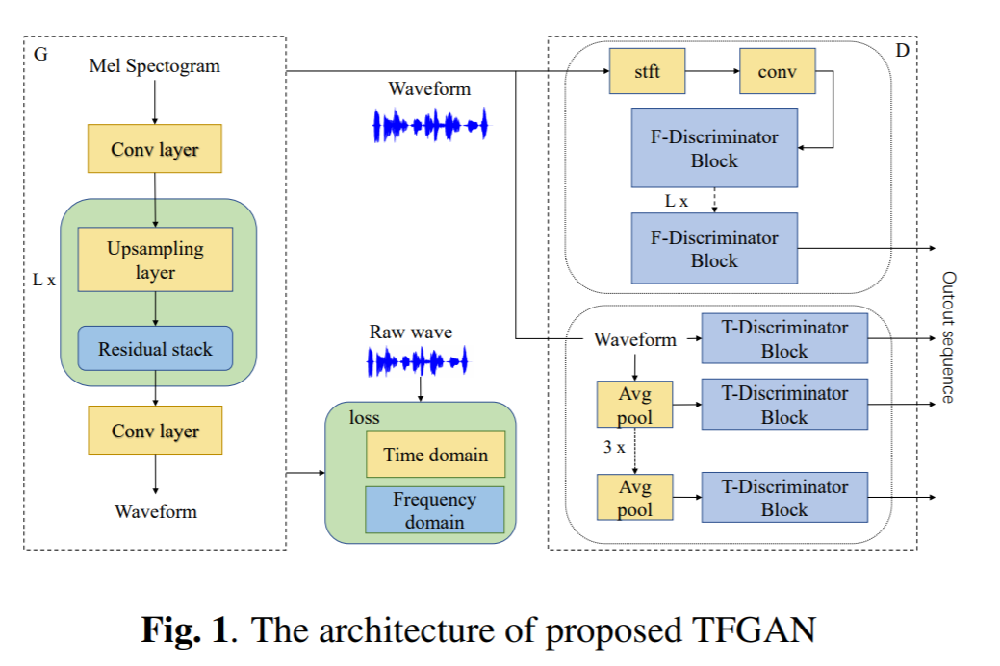

# TFGAN

This repo is Unofficial implements of [TFGAN: Time and Frequency Domain Based Generative Adversarial Network for High-fidelity Speech Synthesis](https://arxiv.org/abs/2011.12206) using Pytorch.


## Requirement
Tested on Python 3.6
```bash
pip install -r requirements.txt
```

## Prepare Dataset

- Download dataset for training. This can be any wav files with sample rate 22050Hz. (e.g. LJSpeech was used in paper)
- preprocess: `python preprocess.py -c config/default.yaml -d [data's root path]`
- Edit configuration `yaml` file

## Train & Tensorboard

- `python trainer.py -c [config yaml file] -n [name of the run]`
  - `cp config/default.yaml config/config.yaml` and then edit `config.yaml`
  - Write down the root path of train/validation files to 2nd/3rd line.
  
- `tensorboard --logdir logs/`

## Inference

- `python inference.py -p [checkpoint path] -i [input mel path]`

## Checkpoint :
- LJSpeech checkpoint [here](https://drive.google.com/drive/folders/1QWAKled8HKLDWbHTRcBMpW5HQ_svXY5j?usp=sharing) .
